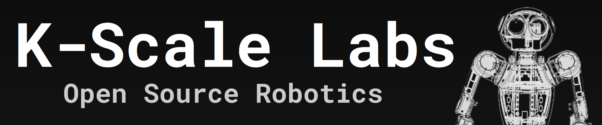

<p align="center">
  <picture>
    
  </picture>
</p>

<div align="center">

[](https://github.com/kscalelabs/onshape/blob/main/LICENSE)
[](https://discord.gg/k5mSvCkYQh)

</div>


# K-Scale Sim Library

A library for simulating Stompy in Isaac Gym. This library is built on top of
the Isaac Gym library and Humanoid-gym and provides a simple interface for
running experiments with Stompy. For a start, we have defined two tasks:
getting up and walking.

We will be adding more tasks and simulator environments in upcoming weeks.

The walking task works reliably with upper body being fixed.
The getting up task is still an open challenge!


## Getting Started

1. Clone this repository:
```bash
git clone https://github.com/kscalelabs/sim.git
cd sim
```

2. Create a new conda environment and install the package:
```bash
conda create --name kscale-sim-library python=3.8.19
conda activate kscale-sim-library
make install-dev
```

3. Install third-party dependencies:

Manually download `IsaacGym_Preview_4_Package.tar.gz` from https://developer.nvidia.com/isaac-gym, and run:
```bash
tar -xvf IsaacGym_Preview_4_Package.tar.gz
conda env config vars set ISAACGYM_PATH=`pwd`/isaacgym
conda deactivate
conda activate kscale-sim-library
make install-third-party-external
```

### Running Stompy experiments
1. Download our URDF model from
```bash
wget https://media.kscale.dev/stompy.tar.gz && tar -xzvf stompy.tar.gz
python sim/scripts/create_fixed_torso.py
export MODEL_DIR=stompy
```

2. Run training with the following command:
```bash
python sim/humanoid_gym/train.py --task=legs_ppo --num_envs=4096 --headless
```
or for full body:
```bash
python sim/humanoid_gym/train.py --task=stompy_ppo --num_envs=4096 --headless
```

3. Run evaluation with the following command:
```bash
python sim/humanoid_gym/play.py --task legs_ppo --sim_device cpu
```

### Errors
After cloning Isaac Gym, sometimes the bindings mysteriously disappear.
To fix this, update the submodule:
```bash
git submodule update --init --recursive
```

If you observe errors with libpython3.8.so.1.0, you can try the following:
```bash
export LD_LIBRARY_PATH=PATH_TO_YOUR_ENV/lib:$LD_LIBRARY_PATH
```

If you still see segmentation faults, you can try the following:
```bash
sudo apt-get vulkan1
```

### Appreciation
- [Humanoid-gym](https://sites.google.com/view/humanoid-gym/)
- [Isaac Gym](https://github.com/NVIDIA-Omniverse/IsaacGymEnvs)
- KScale Labs community for bugspotting and feedback

### Discord
- [Discord](https://discord.com/invite/rhCy6UdBRD)
